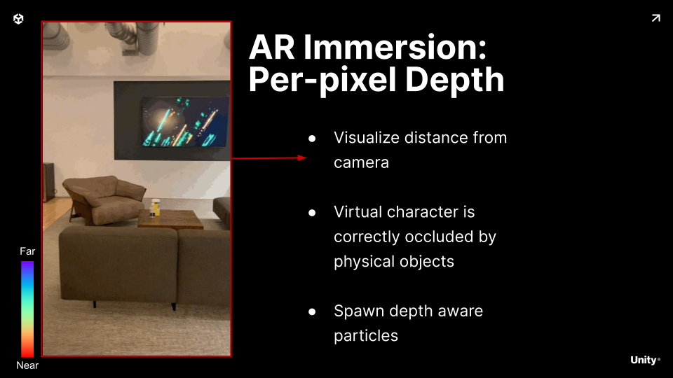
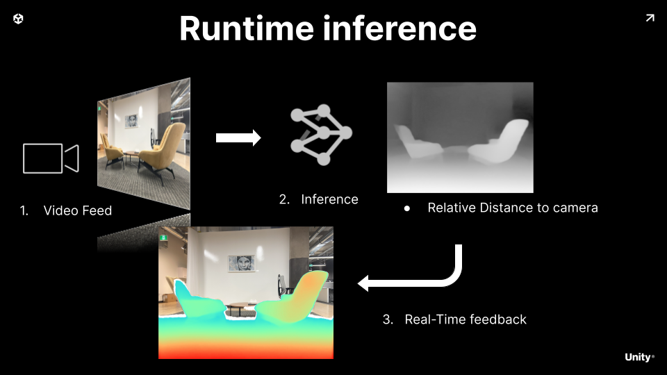
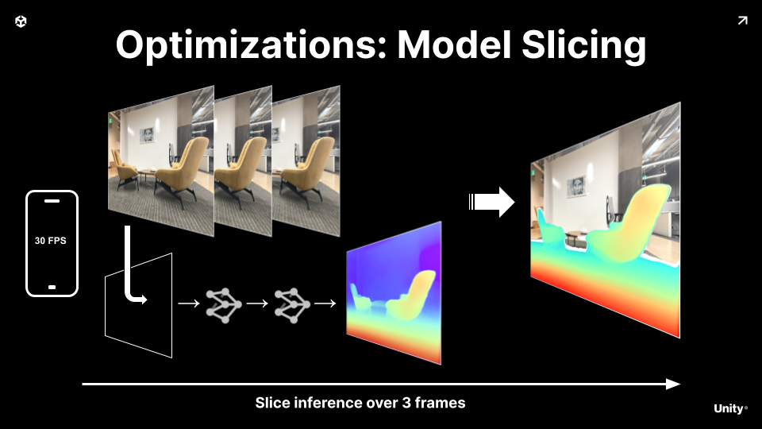

# Mobile Augmented Reality Template

This is a template for a mobile AR experience. It is forked from [Depth Estimation Sample](https://github.com/Unity-Technologies/sentis-samples/tree/main/DepthEstimationSample).

Scenes:
 - CameraBackground: Realtime camera feed shown on the screen.
 - PhoneDemo: Realtime per pixel image to depth estimation.
 - Detection: Detection of video feed.
 
Realtime per pixel image to depth estimation.

## Runtime Inference

To solve this problem we leverage a small Neural Network.

It takes as input the camera stream.

After running inference we get for every pixel of the input image a depth value.

We use this to feedback into the gameplay loop

## Optimization

To keep this within budget we split the model inference over 2 frame.

By running a lower frequency as the refresh rate, we avoid the phone to overheat

## Video Tutorial

## Misc

- **.meta files**: meta files dipicting the asset import settings, resource references, and other information about the asset. They are used by Unity to reference the asset and its properties. They are not required to run the project, but are useful to keep track of the assets and their settings. **so please do include them in your commits.**