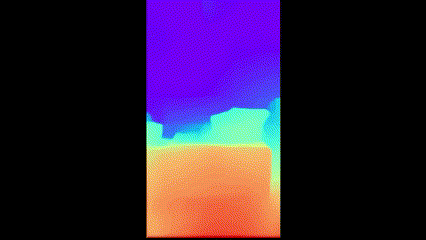
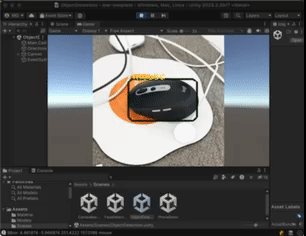
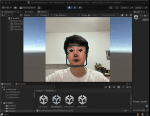

# Mobile Augmented Reality Template

## Quick Links

* [Sentis Doc](https://docs.unity3d.com/Packages/com.unity.sentis@1.2/manual/create-an-input-tensor.html)
* [Unity Huggingface](https://huggingface.co/unity)
* [Unity Render Streaming](https://docs.unity3d.com/Packages/com.unity.renderstreaming@3.1/manual/index.html)

## Roadmap

- [ ] A demo scene locally detecting objects using camera feed
- [ ] save video feed to disk
- [x] webRTC streaming to server
    - [x] unity streaming client (broadcast)
    - [ ] edge server receive stream and processing
    - [ ] streaming result back to client
- [x] WebCamera/Video face/object detection

## Requirements

* Unity Packages
    ```
    com.unity.renderstreaming
    com.unity.sentis
    ```

## Scene Overview

| Scene                                                    | Function                                                                                                                         | Preview                                                     |
|----------------------------------------------------------|:---------------------------------------------------------------------------------------------------------------------------------|-------------------------------------------------------------|
| [CameraBackground](Assets/Scenes/CameraBackground.unity) | Realtime camera feed on the screen                                                                                               |                                                             |
| [PhoneDemo](Assets/Scenes/PhoneDemo.unity)               | Realtime depth estimation for camera [ref](https://github.com/Unity-Technologies/sentis-samples/tree/main/DepthEstimationSample) |                      |
| [ObjectDetection](Assets/Scenes/ObjectDetection.unity)   | Detection of video feed.[ref](https://huggingface.co/unity/sentis-YOLOv8n)                                                       |  |
| [FaceDetection](Assets/Scenes/FaceDetection.unity)       | Detection of faces in video/WebCamera feed. [ref](https://huggingface.co/unity/sentis-blaze-face/tree/main)                      |      |
| [WebRTC-Streaming](Assets/Scenes/streaming-test.unity)   | Streaming videos to other client/browser                                                                                         |                      |
